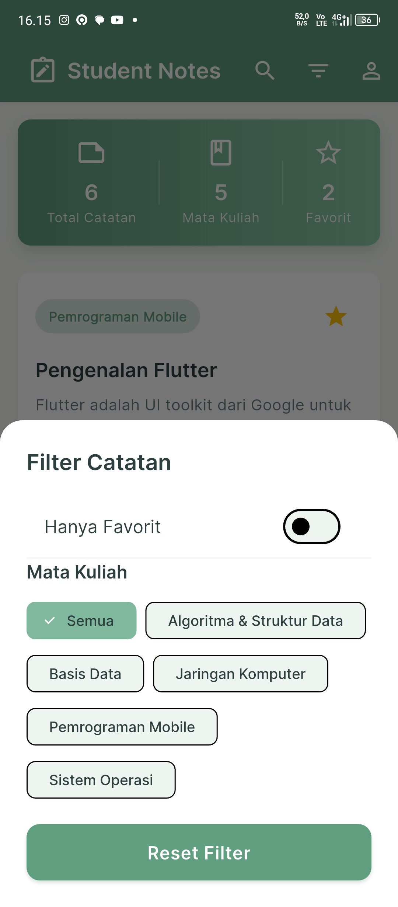

# Student Notes - Aplikasi Pencatatan Kuliah Digital

Aplikasi mobile untuk mahasiswa yang memungkinkan pencatatan kuliah digital dengan fitur lengkap, offline-first, dan user-friendly.


## 🎨 New in v1.0.2

**Modern Green Theme Update!**

- 🌿 Smooth sage green color scheme
- ✨ Inter typography untuk readability lebih baik
- 🌓 Enhanced dark mode
- 📱 Professional, modern design

[Lihat detail update →](docs/THEME_UPDATE_v1.0.2.md)

---

## 🎯 Fitur Utama

### 1. **Autentikasi & Session Management**

- Login dengan email & password (secure SHA-256 hashing)
- Demo account tersedia untuk testing
- Session persistence - auto-login setelah login pertama
- Logout dengan konfirmasi
- Register akun baru

### 2. **CRUD Catatan Kuliah**

- Buat catatan baru dengan judul, mata kuliah, dan konten
- Edit catatan yang sudah ada
- Hapus catatan dengan konfirmasi
- Toggle favorit untuk catatan penting
- Auto-save draft detection

### 3. **CRUD Mata Kuliah**

- Kelola mata kuliah sendiri
- Tambah, edit, hapus mata kuliah
- Pilih warna untuk setiap mata kuliah
- 8 pilihan warna harmonious

### 4. **Search & Filter System**

- Pencarian real-time berdasarkan judul dan konten
- Filter berdasarkan mata kuliah
- Filter hanya catatan favorit
- Kombinasi multiple filters

### 5. **Offline-First Architecture**

- Semua data tersimpan di SQLite local database
- Tidak memerlukan koneksi internet
- Data persisten dan aman
- Database migration support

### 6. **UI/UX Modern**

- Material Design 3
- Modern green theme (Sage Green)
- Inter typography untuk readability
- Dark mode support
- Loading shimmer effects
- Empty states dengan ilustrasi
- Smooth animations
- Responsive design

### 7. **Dashboard & Statistik**

- Total catatan
- Jumlah mata kuliah
- Jumlah catatan favorit
- Daftar catatan terbaru

---

## 📸 Demo Aplikasi

Berikut adalah tampilan aplikasi Student Notes:

### Login & Register

<p align="center">
  
  
</p>

### Dashboard & Profile

<p align="center">
  
  
</p>

### Manajemen Catatan

<p align="center">
  
  
  
</p>

### Manajemen Mata Kuliah

<p align="center">
  
  
</p>

---

## 📚 Dokumentasi

Semua dokumentasi tersedia di folder [`docs/`](docs/):

### 🚀 Quick Start

- [**Quick Start Guide**](docs/QUICK_START.md) - Panduan cepat memulai
- [**Installation Guide**](docs/INSTALLATION_GUIDE.md) - Panduan instalasi lengkap
- [**Demo Account**](docs/DEMO_ACCOUNT.md) - Info akun demo untuk testing

### 📖 User Documentation

- [**Features**](docs/FEATURES.md) - Daftar lengkap fitur
- [**Testing Instructions**](docs/TESTING_INSTRUCTIONS.md) - Panduan testing aplikasi
- [**Login Troubleshooting**](docs/LOGIN_TROUBLESHOOTING.md) - Solusi masalah login

### 👨‍💻 Developer Documentation

- [**API Documentation**](docs/API_DOCUMENTATION.md) - API dan struktur kode
- [**Build Instructions**](docs/BUILD_INSTRUCTIONS.md) - Cara build APK/AAB
- [**Contributing Guide**](docs/CONTRIBUTING.md) - Panduan kontribusi
- [**Testing Guide**](docs/TESTING_GUIDE.md) - Panduan testing untuk developer

### 🎨 Design Documentation

- [**Theme Update v1.0.2**](docs/THEME_UPDATE_v1.0.2.md) - Detail tema baru
- [**Color Reference**](docs/COLOR_REFERENCE.md) - Panduan warna lengkap
- [**Screenshots Guide**](docs/SCREENSHOTS_GUIDE.md) - Panduan screenshot

### 📋 Project Documentation

- [**Project Summary**](docs/PROJECT_SUMMARY.md) - Ringkasan project
- [**Changelog**](docs/CHANGELOG.md) - Riwayat perubahan
- [**Documentation Index**](docs/DOCUMENTATION_INDEX.md) - Index semua dokumentasi

### 📝 Release Notes

- [**Release Notes v1.0.1**](docs/RELEASE_NOTES_v1.0.1.md)
- [**Update Notes v1.0.1**](docs/UPDATE_NOTES_v1.0.1.md)
- [**Release Checklist**](docs/RELEASE_CHECKLIST.md)

---

## 📱 Struktur Halaman

1. **Splash Screen** - Logo animasi dan auto-redirect
2. **Login Screen** - Email/password dengan demo account
3. **Register Screen** - Daftar akun baru
4. **Home Screen** - Dashboard dengan daftar catatan
5. **Note Detail Screen** - CRUD catatan
6. **Course Management Screen** - CRUD mata kuliah
7. **Profile Screen** - Profil user dan pengaturan

---

## 🚀 Quick Start

### Prerequisites

- Flutter SDK (3.9.2 atau lebih baru)
- Dart SDK
- Android Studio / VS Code
- Android Emulator / iOS Simulator / Physical Device

### Instalasi

1. **Clone atau buka project**

```bash
cd student_notes
```

2. **Install dependencies**

```bash
flutter pub get
```

3. **Jalankan aplikasi**

```bash
flutter run
```

### Demo Account

Login dengan akun demo yang sudah tersedia:

- **Email**: `demo@studentnotes.com`
- **Password**: `demo123`

Akun demo sudah berisi 6 catatan contoh dan 5 mata kuliah.

[Lihat panduan lengkap →](docs/QUICK_START.md)

---

## 🗂️ Struktur Project

```
lib/
├── main.dart                    # Entry point aplikasi
├── models/                      # Data models
│   ├── user.dart
│   ├── note.dart
│   └── course.dart
├── database/                    # SQLite database
│   └── database_helper.dart
├── providers/                   # State management (Provider)
│   ├── user_provider.dart
│   ├── note_provider.dart
│   ├── course_provider.dart
│   └── theme_provider.dart
├── screens/                     # UI Screens
│   ├── splash_screen.dart
│   ├── login_screen.dart
│   ├── register_screen.dart
│   ├── home_screen.dart
│   ├── note_detail_screen.dart
│   ├── course_management_screen.dart
│   └── profile_screen.dart
├── widgets/                     # Reusable widgets
│   ├── note_card.dart
│   ├── custom_appbar.dart
│   ├── empty_state.dart
│   └── loading_shimmer.dart
└── utils/                       # Utilities
    ├── constants.dart
    ├── validators.dart
    ├── theme.dart
    └── demo_seeder.dart
```

---

## 🎨 Design System

### Colors (v1.0.2 - New!)

- **Primary**: #5F9E7F (Sage Green) - Smooth dan calming
- **Secondary**: #8BC9A8 (Mint Green) - Fresh dan modern
- **Accent**: #E8A87C (Terracotta) - Warm contrast
- **Background**: #F8FAF7 (Soft Cream) - Natural feel

[Lihat color reference lengkap →](docs/COLOR_REFERENCE.md)

### Typography

- **Font Family**: Inter (modern, readable)
- **Display**: Bold (700), 24-32px
- **Headline**: SemiBold (600), 18-22px
- **Body**: Regular (400), 14-16px
- **Label**: SemiBold (600), 12-16px

**Features:**

- Optimized letter spacing
- Line height 1.6 untuk comfortable reading
- Clear hierarchy

---

## 📦 Dependencies

```yaml
dependencies:
  flutter:
    sdk: flutter
  cupertino_icons: ^1.0.8
  google_fonts: ^6.1.0 # Inter font
  provider: ^6.1.1 # State management
  sqflite: ^2.3.0 # Local database
  path_provider: ^2.1.1
  path: ^1.8.3
  shared_preferences: ^2.2.2 # Session storage
  crypto: ^3.0.7 # Password hashing
  firebase_core: ^2.24.2
  firebase_auth: ^4.15.3
  google_sign_in: ^6.2.1
  intl: ^0.19.0
  uuid: ^4.3.3
```

---

## 📱 Build APK Release

### Android

```bash
# Clean build
flutter clean

# Get dependencies
flutter pub get

# Build APK
flutter build apk --release
```

APK akan tersimpan di: `build/app/outputs/flutter-apk/app-release.apk`

[Lihat panduan build lengkap →](docs/BUILD_INSTRUCTIONS.md)

---

## 🧪 Testing

### Quick Test

1. Install APK
2. Login dengan demo account:
   - Email: `demo@studentnotes.com`
   - Password: `demo123`
3. Explore fitur-fitur

### Full Testing

Lihat [Testing Instructions](docs/TESTING_INSTRUCTIONS.md) untuk panduan lengkap.

---

## 🔒 Security

- ✅ SHA-256 password hashing
- ✅ Unique email constraint
- ✅ Secure session management
- ✅ Input validation & sanitization
- ✅ SQL injection prevention

---

## 📝 Changelog

### [1.0.2] - 2026-01-15

- 🎨 New modern green theme
- ✨ Inter typography
- 🌓 Enhanced dark mode

### [1.0.1] - 2026-01-15

- 🐛 Fixed authentication issues
- ✨ Added demo account
- ✨ Added course management
- 🔒 Password hashing

### [1.0.0] - 2026-01-14

- 🎉 Initial release

[Lihat changelog lengkap →](docs/CHANGELOG.md)

---

## 🎯 Future Enhancements

- [ ] Firebase Firestore sync
- [ ] Real Google Sign-In integration
- [ ] Rich text editor
- [ ] Image attachments
- [ ] Export to PDF
- [ ] Reminder notifications
- [ ] Cloud backup
- [ ] Sharing notes

---

## 👨‍💻 Contributing

Contributions, issues, and feature requests are welcome!

Lihat [Contributing Guide](docs/CONTRIBUTING.md) untuk panduan lengkap.

---

## 📄 License

This project is created for educational purposes.

---

## 📞 Support

Jika ada pertanyaan atau masalah:

1. Cek [Documentation Index](docs/DOCUMENTATION_INDEX.md)
2. Baca [Login Troubleshooting](docs/LOGIN_TROUBLESHOOTING.md)
3. Lihat [Testing Instructions](docs/TESTING_INSTRUCTIONS.md)

---

## 🌟 Highlights

- ✅ **Offline-First** - Bekerja tanpa internet
- ✅ **Modern UI** - Material Design 3 dengan green theme
- ✅ **Secure** - SHA-256 password hashing
- ✅ **Fast** - SQLite local database
- ✅ **Readable** - Inter typography dengan line height optimal
- ✅ **Dark Mode** - Support tema gelap
- ✅ **Demo Ready** - Akun demo tersedia

---

**Dibuat dengan ❤️ menggunakan Flutter**

**Version:** 1.0.2+3  
**Last Updated:** January 15, 2026
